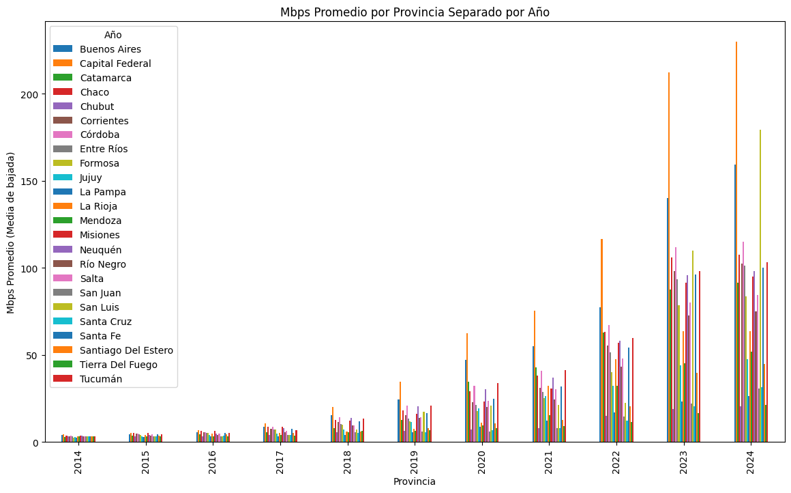
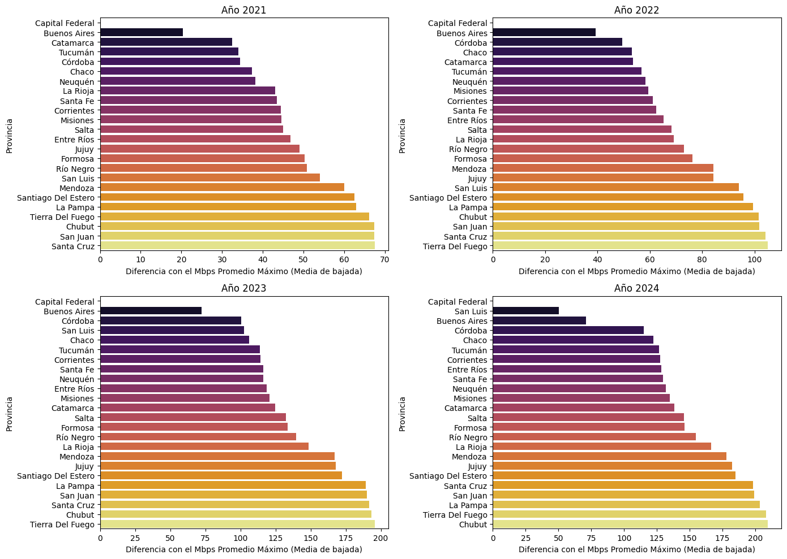
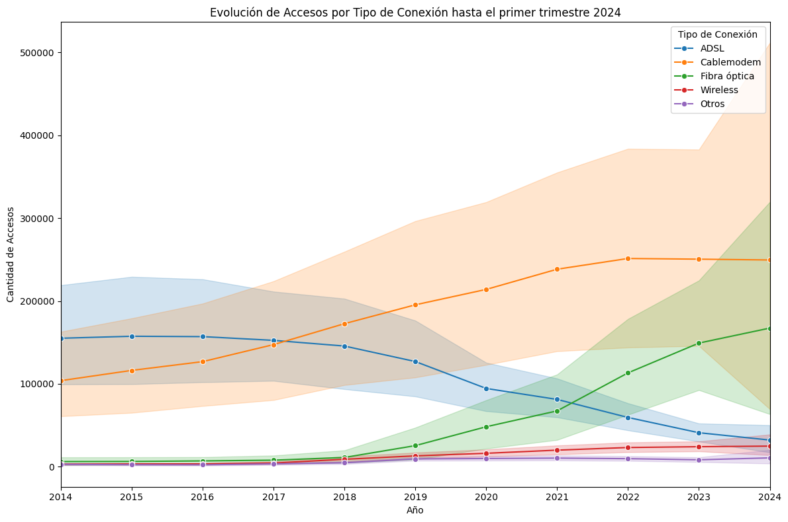

# <h1 align=center> **PROYECTO INDIVIDUAL Nº2** </h1>
# <h1 align=center> **Carolina del Valle Garay** </h1>

# <h1 align=center>**`Telecomunicaciones`**</h1>


## ```Introducción```

El ser humano ha intentado superar las distancias para enviar y recibir señales desde épocas muy tempranas, y hoy en día, la manera en que nos relacionamos y comunicamos ha cambiado radicalmente gracias a las telecomunicaciones.

Las telecomunicaciones se refieren a la transmisión de información a través de medios electrónicos como la telefonía, la televisión, la radio y, más recientemente, el internet. Estos medios permiten la transmisión de información entre personas, organizaciones y dispositivos a grandes distancias.

El internet, en particular, es una red global de computadoras interconectadas que facilita el intercambio de información en tiempo real. Desde su creación, ha transformado significativamente nuestras vidas, alterando la forma en que nos comunicamos, trabajamos, aprendemos y nos entretenemos.

La industria de las telecomunicaciones ha desempeñado un papel vital en nuestra sociedad, facilitando la difusión de información a nivel mundial y garantizando la comunicación continua, incluso durante una pandemia global. La transferencia de datos y comunicaciones se realiza en su mayoría a través de internet, líneas telefónicas fijas y telefonía móvil, lo que permite la conectividad en prácticamente cualquier lugar del mundo.

En este contexto, una empresa prestadora de servicios de telecomunicaciones me ha encargado la realización de un análisis completo que permita reconocer el comportamiento de este sector a nivel nacional. La principal actividad de la empresa es brindar acceso a internet, pero también es importante considerar el comportamiento asociado al resto de los servicios de comunicación. Esto tiene como objetivo orientar a la empresa en brindar una buena calidad de sus servicios, identificar oportunidades de crecimiento y poder plantear soluciones personalizadas a sus posibles clientes.


## :white_check_mark: ```Objetivos ```

- :pushpin: Realizar un análisis exhaustivo del comportamiento del Sector de Telecomunicaciones en Argentina, con un enfoque especial en el acceso a internet y otros servicios de comunicación.
- :pushpin: Establecer métricas de rendimiento clave (KPIs) para medir la eficiencia y efectividad de los servicios.
- :pushpin: Detectar oportunidades de expansión y crecimiento en el mercado de telecomunicaciones, considerando tanto la penetración de internet como la adopción de nuevas tecnologías de comunicación en distintas regiones del país

## :white_check_mark: ```Desarrollo del Proyecto```

Para llevar a cabo los objetivos se realizó un análisis exhaustivo del comportamiento de los datos provenientes de https://indicadores.enacom.gob.ar/datos-abiertos. Este análisis se centró especialmente en el acceso a internet y otros servicios de comunicación. Se utilizaron diversas técnicas de Análisis Exploratorio de Datos (EDA) para identificar valores faltantes, detectar valores atípicos y registros duplicados, y generar visualizaciones coherentes que faciliten la interpretación de la información.

**A continuación se muestran los resultados más destacados:**

### :globe_with_meridians: Velocidad de Conexión a Internet por Provincia

Las provincias muestran una tendencia clara de aumento en las velocidades de conexión a internet a lo largo de los años, especialmente a partir de 2020. Existen diferencias marcadas en las velocidades de conexión entre provincias, Capital Federal y Buenos Aires llevan la delantera. Pese a las diferencias, la brecha en la velocidad de conexión entre provincias se ha reducido en los últimos años, especialmente en el 2023 y en el primer trimestre del 2024. 





### :globe_with_meridians: Accesos a Internet por Tipo de Tecnología

Se observa nuevamente que Buenos Aires aparece constantemente como la provincia con más accesos en todos los tipos de conexión, lo que indica una infraestructura de telecomunicaciones bien desarrollada y una alta demanda de servicios de internet. Hay una notable disparidad entre las provincias en cuanto al acceso a diferentes tipos de conexiones, lo cual podría ser un indicador de las diferencias en desarrollo tecnológico e infraestructura entre las regiones.



