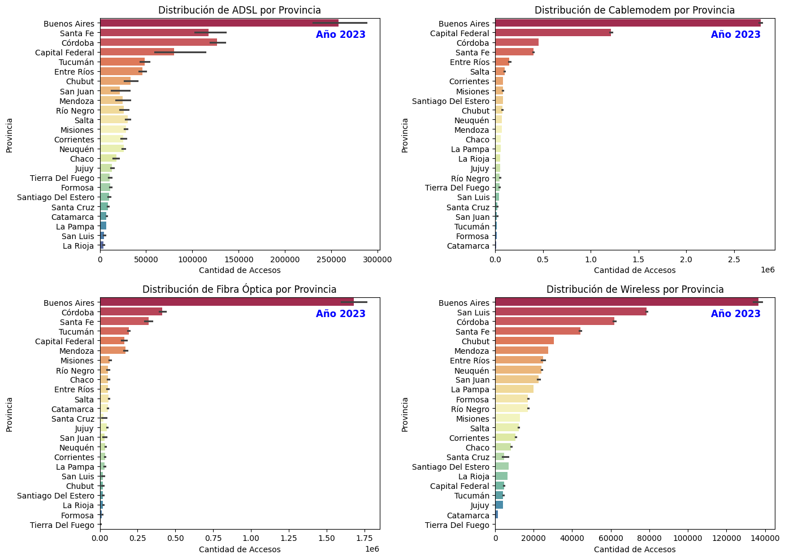
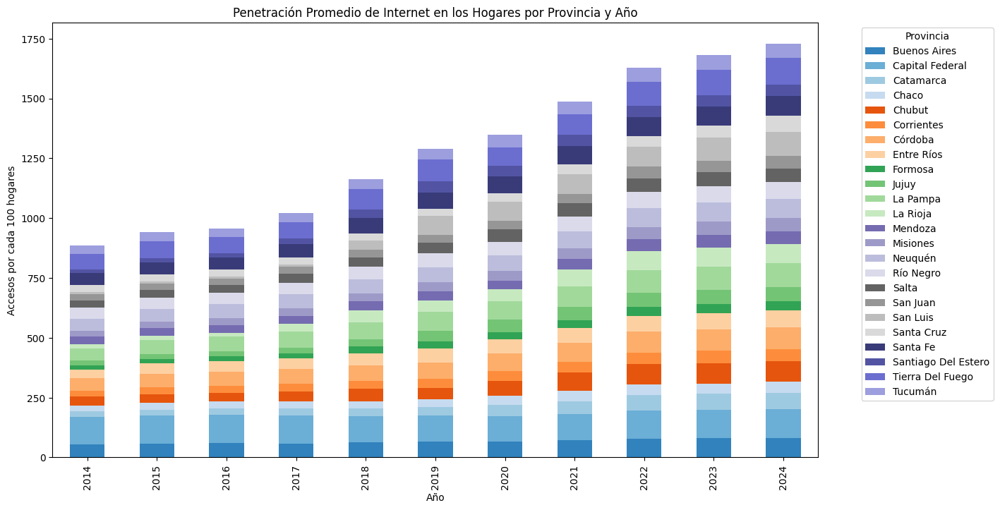
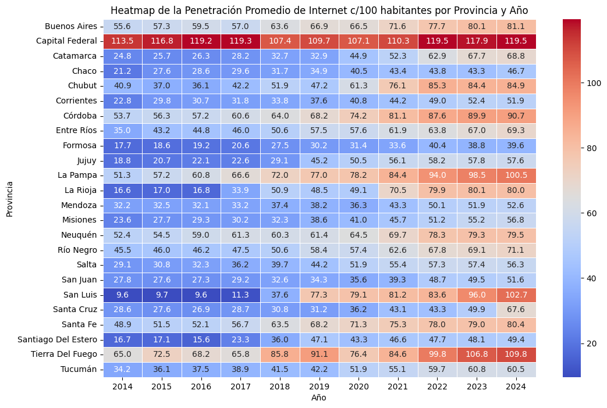
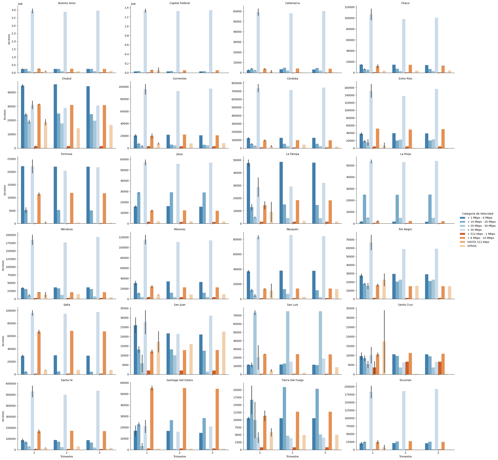
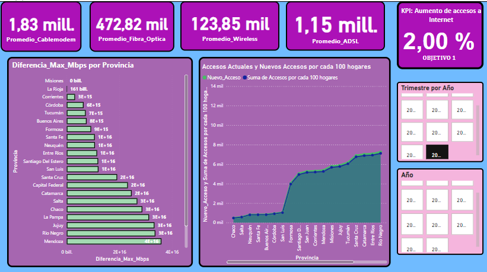

# <h1 align=center> **PROYECTO INDIVIDUAL Nº2** </h1>
# <h1 align=center> **Carolina del Valle Garay** </h1>

# <h1 align=center>**`Telecomunicaciones`**</h1>


## ```Introducción```

El ser humano ha intentado superar las distancias para enviar y recibir señales desde épocas muy tempranas, y hoy en día, la manera en que nos relacionamos y comunicamos ha cambiado radicalmente gracias a las telecomunicaciones.

Las telecomunicaciones se refieren a la transmisión de información a través de medios electrónicos como la telefonía, la televisión, la radio y, más recientemente, el internet. Estos medios permiten la transmisión de información entre personas, organizaciones y dispositivos a grandes distancias.

El internet, en particular, es una red global de computadoras interconectadas que facilita el intercambio de información en tiempo real. Desde su creación, ha transformado significativamente nuestras vidas, alterando la forma en que nos comunicamos, trabajamos, aprendemos y nos entretenemos.

La industria de las telecomunicaciones ha desempeñado un papel vital en nuestra sociedad, facilitando la difusión de información a nivel mundial y garantizando la comunicación continua, incluso durante una pandemia global. La transferencia de datos y comunicaciones se realiza en su mayoría a través de internet, líneas telefónicas fijas y telefonía móvil, lo que permite la conectividad en prácticamente cualquier lugar del mundo.

En este contexto, una empresa prestadora de servicios de telecomunicaciones me ha encargado la realización de un análisis completo que permita reconocer el comportamiento de este sector a nivel nacional. La principal actividad de la empresa es brindar acceso a internet, pero también es importante considerar el comportamiento asociado al resto de los servicios de comunicación. Esto tiene como objetivo orientar a la empresa en brindar una buena calidad de sus servicios, identificar oportunidades de crecimiento y poder plantear soluciones personalizadas a sus posibles clientes.


## :white_check_mark: ```Objetivos ```

- :pushpin: Realizar un análisis exhaustivo del comportamiento del Sector de Telecomunicaciones en Argentina, con un enfoque especial en el acceso a internet y otros servicios de comunicación.
- :pushpin: Establecer Indicadores Claves de Rendimiento (KPIs) para medir la eficiencia y efectividad de los servicios.
- :pushpin: Detectar oportunidades de expansión y crecimiento en el mercado de telecomunicaciones, considerando tanto la penetración de internet como la adopción de nuevas tecnologías de comunicación en distintas regiones del país

## :white_check_mark: ```Desarrollo del Proyecto```

Para llevar a cabo los objetivos se realizó un análisis exhaustivo del comportamiento de los datos provenientes de https://indicadores.enacom.gob.ar/datos-abiertos. Este análisis se centró especialmente en el acceso a internet y otros servicios de comunicación. Se utilizaron diversas técnicas de Análisis Exploratorio de Datos (EDA) para identificar valores faltantes, detectar valores atípicos y registros duplicados, y generar visualizaciones coherentes que faciliten la interpretación de la información.

**A continuación se muestran los resultados más destacados:**

### :globe_with_meridians: Velocidad de Conexión a Internet por Provincia

El análisis de los datos ha permitido mostrar  una tendencia clara de aumento en las velocidades de conexión a internet a lo largo de los años en Argentina, especialmente a partir de 2020. Existen diferencias marcadas en las velocidades de conexión entre provincias, Capital Federal y Buenos Aires llevan la delantera. Pese a las diferencias, la brecha en la velocidad de conexión entre provincias se ha reducido en los últimos años, especialmente en el 2023 y en el primer trimestre del 2024. 


### :globe_with_meridians: Accesos a Internet por Tipo de Tecnología

Se observa nuevamente que Buenos Aires aparece constantemente como la provincia con más accesos en todos los tipos de conexión, lo que indica una infraestructura de telecomunicaciones bien desarrollada y una alta demanda de servicios de internet. Hay una notable disparidad entre las provincias en cuanto al acceso a diferentes tipos de conexiones, lo cual podría ser un indicador de las diferencias en desarrollo tecnológico e infraestructura entre las regiones.



La evolución de accesos a internet por tipo de conexión desde 2014 hasta el primer trimestre de 2024 muestra una transición hacia tecnologías más modernas y rápidas, como Cablemódem y fibra óptica, en detrimento de ADSL.


.

### :globe_with_meridians: Penetración de Internet en Hogares
La penetración promedio de internet en los hogares de Argentina ha mostrado un crecimiento sostenido desde 2014 hasta 2024 y el aumento es notable en los últimos años, especialmente a partir de 2020. Se observa nuevamente que la penetración es más alta en provincias como Buenos Aires y Capital Federal. Hay provincias con menor crecimiento relativo que han mejorado, pero a un ritmo más lento.




El siguiente mapa de calor muestra que se siguen presentando disparidades entre las provincias, aunque la brecha se ha reducido en los últimos años.



Los dos gráficos anteriores destacan el progreso en la expansión de la infraestructura de internet en Argentina, pero también subrayan la necesidad de continuar invirtiendo en regiones menos desarrolladas para asegurar un acceso equitativo a internet en todo el país.


### :globe_with_meridians: Accesos a Internet Desglosados por Velocidad de Conexión

En el caso de los accesos a Internet según la velocidad de conexión, la mayoría de las provincias presentan un predominio de velocidades entre + 6 Mbps y + 20 Mbps, aunque existe una notable variabilidad en la adopción de velocidades más altas. Buenos Aires y Capital Federal destacan por tener una mayor cantidad de accesos en categorías de mayor velocidad (+ 30 Mbps), mientras que provincias como Catamarca y Jujuy muestran una predominancia de velocidades más bajas, indicando una infraestructura de alta velocidad menos desarrollada.

Se observa un crecimiento en las conexiones de fibra óptica y wireless en varias provincias, lo cual refleja una tendencia hacia la modernización de la infraestructura de internet. Adicionalmente, algunos incrementos estacionales son evidentes, con fluctuaciones en el número de accesos en diferentes trimestres, lo que puede estar relacionado con la implementación de nuevas infraestructuras, campañas de expansión o época vacacional.




## 🏆 Indicadores Claves de Rendimiento (KPIs)


KPI :one: : **Acceso al servicio de Internet**

*  Métrica: Esta métrica se basa en medir el incremento porcentual del acceso al servicio de internet en cada provincia, calculando el número de hogares con acceso a internet por cada 100 hogares.

* Datos Necesarios: Número de hogares con acceso a internet en el trimestre actual y número proyectado de hogares con acceso a internet para el próximo trimestre.

* Objetivo: Aumentar en un 2% el número de hogares con acceso a internet por cada 100 hogares en cada provincia para el próximo trimestre.
  
  

KPI :two: : **Acceso al servicio de Fibra Óptica**

*  Métrica: Esta métrica se basa en medir el incremento porcentual del acceso al servicio de Fibra Óptica en cada provincia.
* Datos Necesarios: Número de hogares con acceso al servicio de Fibra Óptica en el trimestre actual y número proyectado de hogares con acceso al servicio de Fibra Óptica para el próximo trimestre.

* Objetivo: Aumentar en un 4% el número de hogares con acceso al servicio de Fibra Óptica en cada provincia para el próximo trimestre.

KPI :three: : **Acceso a conexiones mayores a 20 Mbps**

*  Métrica: Esta métrica se basa en medir el incremento porcentual de las conexiones de internet con velocidades mayores a 20 Mbps en cada provincia.

* Datos Necesarios: Número de conexiones actuales con velocidades mayores a 20 Mbps en el trimestre actual y número proyectado de conexiones con velocidades mayores a 20 Mbps para el próximo trimestre.

* Objetivo: Aumentar en un 10% las conexiones mayores a 20 Mbps para las provincias que tienen baja velocidad de conexión


## :pencil: Dashboard

Se desarrolló un dashboard en PowerBi que permite explorar detalladamente los datos mediante filtros interactivos, facilitando la interpretación de la información y apoyando las sugerencias informadas para mejorar la calidad del servicio, identificar áreas de inversión y desarrollar soluciones personalizadas para los clientes.

